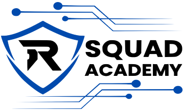
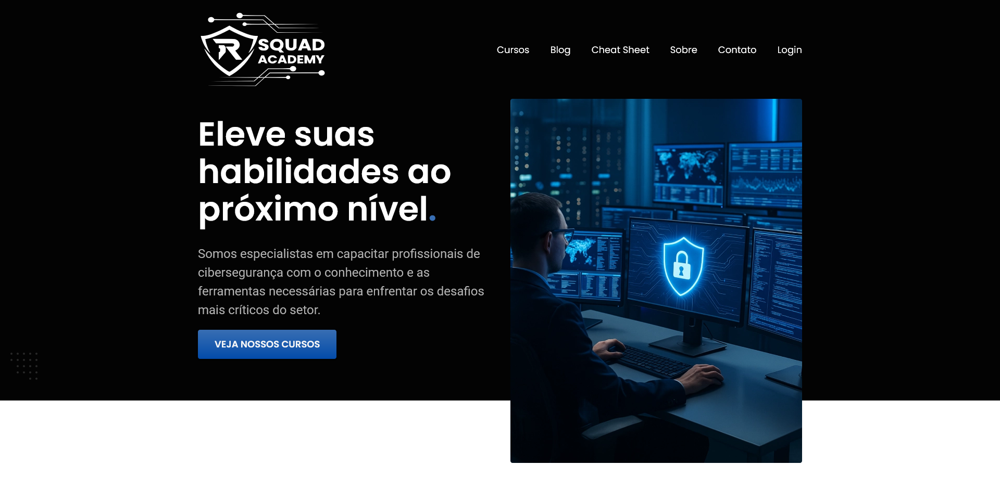

# RSquad Academy

## Project with Laravel 12 and Docker with Laravel Pint, PEST, Debugar, AdminLTE3, DataTables server side and Spatie ACL

### Resources

-   Basic user controller with 2FA authentication
-   Visitors log
-   API routes with JWT auth
-   Courses with categories, classes and students
-   Blog
-   Cheat Sheet
-   Contacts

### Usage in development environment

-   `cp .env.example .env`
-   Edit .env parameters
-   `composer install`
-   `php artisan key:generate`
-   `php artisan jwt:secret`
-   `alias sail='[ -f sail ] && sh sail || sh vendor/bin/sail'`
-   `sail artisan storage:link`
-   `sail artisan migrate --seed`
-   `sail npm install && npm run dev`