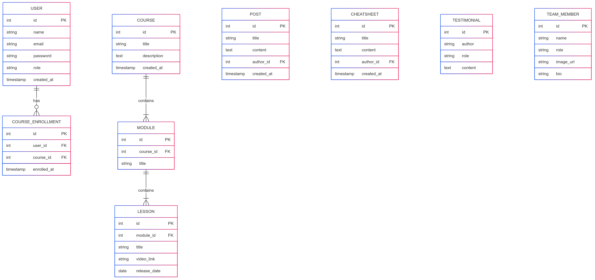

# RSquad Academy

## Project with Laravel 12 and Docker with Laravel Pint, PEST, Debugar, AdminLTE3, DataTables server side and Spatie ACL

## **1. Modelagem de Casos de Uso (Use Case)**

### **Atores:**

-   Visitante
-   Aluno
-   Instrutor
-   Administrador
-   Programador

### **Casos de Uso:**

#### Visitante

-   Visualizar página inicial
-   Visualizar cursos disponíveis
-   Visualizar cheatsheets
-   Visualizar artigos/posts
-   Visualizar termos de uso e política de cookies
-   Enviar formulário de contato
-   Se cadastrar como aluno

#### Aluno

-   Autenticar/Login
-   Visualizar seu dashboard
-   Visualizar cursos matriculados
-   Acessar aulas liberadas por data
-   Visualizar cheatsheets
-   Visualizar posts
-   Editar dados do perfil

#### Instrutor

-   Autenticar/Login
-   Gerenciar alunos
-   Gerenciar cursos
-   Gerenciar módulos e aulas (com liberação por data)
-   Gerenciar posts/artigos
-   Gerenciar cheatsheets
-   Acompanhar progresso dos alunos (opcional)

#### Administrador

-   Autenticar/Login
-   Gerenciar alunos
-   Gerenciar cursos
-   Gerenciar módulos e aulas (com liberação por data)
-   Gerenciar posts/artigos
-   Gerenciar cheatsheets
-   Gerenciar conteúdo da home (testemunhos, equipe, dados institucionais)
-   Acompanhar progresso dos alunos (opcional)

---

## **2. Modelagem do Banco de Dados (entidades principais)**

---

## **3. Layout e Componentização (para o Frontend)**

**Página Home**

-   Hero
-   Sobre a empresa
-   Cursos (listagem com link para detalhes)
-   Cheatsheets (atalhos)
-   Posts/Artigos recentes
-   Equipe
-   Testemunhos
-   Call to action
-   Footer

**Outras Páginas**

-   Página de Curso (detalhes + matrícula)
-   Página de Cheatsheet
-   Página de Post
-   Cheatsheet/Post Individual
-   Página de login
-   Dashboard Aluno
-   Dashboard Admin

---

## **Resumo da Estrutura Modular**

| Módulo              | Função Principal                                         |
| ------------------- | -------------------------------------------------------- |
| **Usuários**        | Registro, autenticação, gerenciamento de permissões      |
| **Cursos**          | Cadastro de cursos e módulos                             |
| **Aulas**           | Controle de aulas com liberação por data                 |
| **Alunos**          | Cadastro, matrícula, progresso                           |
| **Posts**           | Blog institucional com conteúdos técnicos e atualizações |
| **Cheatsheets**     | Conteúdo técnico resumido em formato rápido              |
| **Dashboard Admin** | Painel de gestão do conteúdo                             |
| **Dashboard Aluno** | Painel com cursos e aulas disponíveis                    |

### Resources

-   Basic user controller
-   2FA authentication
-   Visitors log
-   API routes with JWT auth
-   Course categories module
-   Courses module

### Usage in development environment

-   `cp .env.example .env`
-   Edit .env parameters
-   `composer install`
-   `php artisan key:generate`
-   `php artisan jwt:secret`
-   `alias sail='[ -f sail ] && sh sail || sh vendor/bin/sail'`
-   `sail artisan storage:link`
-   `sail artisan migrate --seed`
-   `sail npm install && npm run dev`

### Test login

-   user: <programador@base.com>
-   pass: 12345678
-   user: <admin@base.com>
-   pass: 12345678
-   user: <instructor@base.com>
-   pass: 12345678
-   user: <student@base.com>
-   pass: 12345678
